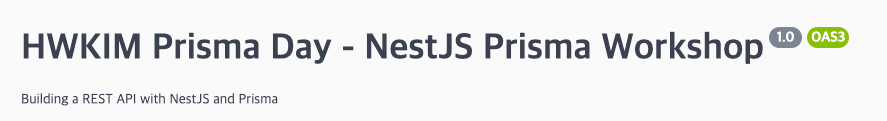

# NestJS with Prisma Workshop project

NestJs API Server using Prisma ORM by HWKIM

## goal
- Factoring Rest API with Prisma on NestJS server
- Error Handling
- Pagination
- Authentication
- API Documentation

## env
- NestJS
- Prisma
- Swagger API
- SQLITE

## reference
2021 Prisma Day WorkShop / Marc Stammerjohann's Practice
- [notion](https://pris.ly/day2021-nestjs)
- [workshop](https://www.youtube.com/watch?v=mmbd5hcQUaY)
